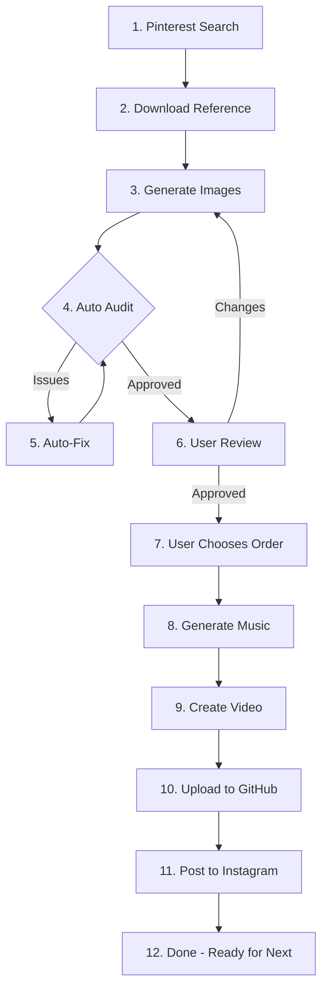

# Island Splash - Complete Automation System
## Version 1.0 - March 2026

---

## Table of Contents
1. [Overview](#overview)
2. [Pre-Automation Setup](#pre-automation-setup)
3. [Full Flow Diagram](#full-flow-diagram)
4. [Step-by-Step Process](#step-by-step-process)
5. [API Keys & Credentials](#api-keys--credentials)
6. [Image Generation Rules](#image-generation-rules)
7. [Music Generation](#music-generation)
8. [Video Creation](#video-creation)
9. [Posting to Instagram](#posting-to-instagram)
10. [Troubleshooting](#troubleshooting)

---

## Overview

This system automates the creation of Instagram posts for Island Splash beverages:
- Find references automatically from Pinterest
- Generate AI images based on references
- Create video with embedded music
- Post to Instagram automatically

**Cost per post:** ~$0.10-0.15 (mainly AI generation)

---

## Pre-Automation Setup

### Required Accounts
1. **Google Cloud** - For Gemini AI image generation
2. **Eleven Labs** - For music generation
3. **ImgBB** - For image hosting (free)
4. **GitHub** - For video hosting
5. **Blotato** - For Instagram posting
6. **Pinterest** - For finding reference images

### Required Installs
```bash
# FFmpeg for video creation
brew install ffmpeg  # macOS
# or
sudo apt install ffmpeg  # Linux

# GitHub CLI for uploading videos
brew install gh  # macOS
```

### Environment Variables
```
GEMINI_API_KEY=...
ELEVEN_LABS_KEY=...
IMGBB_KEY=...
BLOTATO_KEY=...
GITHUB_TOKEN=...
```

---

## Full Flow Diagram



---

## Step-by-Step Process

### Step 1: Pinterest Search
**Purpose:** Find reference images automatically

**How it works:**
- Browser automation searches Pinterest
- Keywords: "tropical beverage advertising", "orange soda beach ad", etc.
- Extracts image URLs from search results

**Code:** `pinterest-refs.js`

**Example search terms:**
- tropical beverage advertising
- summer drink marketing
- fruit juice product design
- caribbean drink ads
- soda advertising

---

### Step 2: Download Reference
**Purpose:** Get the actual image file

**Process:**
1. Get Pinterest pin URL
2. Extract image URL from page
3. Download to local storage

**Commands:**
```bash
curl -s "https://www.pinterest.com/pin/246149935871154426/" | grep -o "https://i.pinimg.com[^']*\.jpg"
curl -o reference.jpg "IMAGE_URL"
```

**Storage:** `/saved/pinterest-ref-N.jpg`

---

### Step 3: Generate Images
**Purpose:** Create Island Splash ads from references

**AI Model:** Gemini 3.1 Flash (gemini-3.1-flash-image-preview)

**Product Selection:** Rotate through all 7 Island Splash flavors:
1. Sorrel
2. Guava Pine
3. Lime
4. Mango Passion
5. Mauby
6. Peanut Punch
7. Pine Ginger

**Code:**
```javascript
const model = genAI.getGenerativeModel({ 
  model: 'gemini-3.1-flash-image-preview' 
});

const prompt = `Island Splash ad. Product: ${productName}. 
NO website text like www.islandsplash.com.
Use brand colors: #FF6B00, #228B22, WHITE, BLACK.
Only show actual ingredients from the bottle label.
9:16 HD.`;
```

---

### Step 4: Auto Audit
**Purpose:** Quality control before human review

**Checklist:**
- ✅ Products match product images?
- ✅ Brand colors correct (#FF6B00 orange, #228B22 green)?
- ✅ No wrong reference text (like "frenzy", "Teenz")?
- ✅ No reference brand info (FSSAI, social handles)?
- ✅ Products sharp (not blurry)?
- ✅ Label: white background, black text, black cap?
- ✅ No website URLs?
- ✅ Correct ingredients (only from label)?
- ✅ Bottle cap only (no straw unless drink box)?

**If issues found:** Auto-regenerate with fixes

---

### Step 5: User Review
**Purpose:** Human approval before posting

**Process:**
1. Send generated images to user
2. User reviews: Good / Bad / Fix
3. If fixes needed, regenerate
4. Continue until approved

---

### Step 6: User Chooses Order
**Purpose:** Determine post slide order

**Process:**
1. Display all approved images
2. User specifies order (1-5)
3. Proceed with chosen order

---

### Step 7: Generate Music
**Purpose:** Create instrumental background music

**API:** Eleven Labs Music API

**Prompt:** "instrumental tropical caribbean upbeat summer vibes island music, no vocals, no singing, background music only"

**Duration:** 15-30 seconds (minimum 15 sec)

**Code:**
```javascript
const result = await fal.subscribe("fal-ai/minimax-music/v2", {
  input: { prompt: "instrumental tropical caribbean upbeat" }
});
```

---

### Step 8: Create Video
**Purpose:** Combine images + music into video

**Tool:** FFmpeg

**Specifications:**
- Duration: 30+ seconds
- Format: 9:16 (1080x1920) HD
- Images: 5 slides × 6 seconds each = 30 seconds
- Audio: Embedded music track
- Codec: H.264, AAC audio

**Code:**
```bash
ffmpeg -y -f concat -safe 0 -i concat.txt -i music.mp3 \
  -vf "scale=1080:1920:force_original_aspect_ratio=decrease,pad=1080:1920:(ow-iw)/2:(oh-ih)/2:black" \
  -c:v libx264 -preset fast -crf 23 \
  -c:a aac -b:a 192k -shortest -t 30 output.mp4
```

**Output:** `/saved/postN-reel.mp4`

---

### Step 9: Upload to GitHub
**Purpose:** Get public URL for Blotato

**Process:**
1. Push video to GitHub repository
2. Enable GitHub Pages
3. Get direct URL

**Repository:** `Pu11en/islandsplash-videos`

**URL format:** `https://pu11en.github.io/islandsplash-videos/postN-reel.mp4`

---

### Step 10: Post to Instagram
**Purpose:** Publish to Island Splash account

**API:** Blotato MCP

**Account ID:** 27011 (islandsplashjuice)

**Code:**
```javascript
await callBlotato("blotato_create_post", {
  accountId: "27011",
  platform: "instagram",
  text: caption,
  mediaUrls: [videoUrl],
  mediaType: "reel"
});
```

---

## API Keys & Credentials

| Service | Key | Purpose |
|---------|-----|---------|
| Google Gemini | GEMINI_API_KEY | Image generation |
| Eleven Labs | 1e03a9f4... | Music generation |
| ImgBB | 4dc80b72... | Image hosting |
| Blotato | blt_PBWdgM... | Instagram posting |
| GitHub | gh auth | Video hosting |

---

## Image Generation Rules

### Brand Colors (MUST USE)
- **Orange:** #FF6B00
- **Green:** #228B22
- **White:** #FFFFFF
- **Black:** #000000

### Product Labels
- White background
- Black text
- Black cap
- NO website URLs

### Content Rules
- ❌ NO reference brand names (frenzy, Teenz, etc.)
- ❌ NO FSSAI numbers
- ❌ NO social media handles from references
- ❌ NO website URLs (www.islandsplash.com)
- ❌ NO placeholder text like "(brand name)"
- ❌ NO wrong ingredients (only from actual label)
- ❌ NO straws (unless drink box - use cap)

### Quality Standards
- Products must be sharp (same quality as reference background)
- 9:16 vertical format
- HD resolution (1080x1920)
- Products match actual Island Splash bottles

---

## Music Generation

### Specifications
- **Type:** Instrumental only (NO vocals)
- **Prompt:** "instrumental tropical caribbean upbeat summer vibes island music, no vocals, no singing, background music only"
- **Duration:** Minimum 15 seconds, recommended 15-30 seconds

### API
- Endpoint: Eleven Labs via FAL AI
- Model: minimax-music/v2

---

## Video Creation

### Specifications
- **Duration:** 30+ seconds
- **Resolution:** 1080x1920 (9:16 HD)
- **Format:** MP4 (H.264 video, AAC audio)
- **Slide timing:** 5 images × 6 seconds = 30 seconds
- **Audio:** Embedded music track

### FFmpeg Settings
```bash
# Scale to 9:16
scale=1080:1920

# Video codec
-c:v libx264 -preset fast -crf 23

# Audio codec  
-c:a aac -b:a 192k

# Trim to 30 seconds
-t 30
```

---

## Posting to Instagram

### Blotato Configuration
- **Account:** islandsplashjuice (27011)
- **Platform:** instagram
- **Media type:** reel
- **Caption:** Included with post
- **Hashtags:** Applied to caption

### Caption Format
```
Taste the Caribbean! 🌴 Fresh island flavors that transport you to paradise. Which flavor is your favorite? 🍹

#IslandSplash #TropicalDrinks #CaribbeanJuice #FreshFruit #SummerVibes #IslandLife #TropicalParadise #CaribbeanFlavors #RefreshingDrinks #FruitJuice
```

---

## Troubleshooting

### Image Generation Issues
- **Blurry products:** Add "Products MUST be same sharpness as reference" to prompt
- **Wrong colors:** Specify exact hex codes (#FF6B00, #228B22)
- **Wrong text:** Add "NO [brand name] from reference"

### Music Issues
- **Has vocals:** Change prompt to "instrumental only, no vocals"
- **Too short:** Increase duration_seconds

### Posting Issues
- **Video not loading:** Check GitHub Pages is enabled
- **Wrong format:** Ensure video is MP4, H.264 codec

### Messaging Issues
- **Message fails:** Add `buttons: []` to message payload
- **Plugin error:** Restart OpenClaw gateway

---

## File Structure

```
/islandsplash-autoads/
├── SYSTEM.md           # System overview
├── FLOW.md             # Mermaid flow diagram
├── README.md           # This file
├── auto-poster.js      # Main automation script
├── blotato-poster.js   # Instagram posting
├── pinterest-refs.js    # Pinterest search
├── carousel.js         # Carousel generation
├── music/
│   ├── generate.js     # Music generation
│   └── README.md       # Music setup
├── products/           # Island Splash product images
└── saved/              # Generated content
    ├── pinterest-ref-N.jpg
    ├── pinterest-generated-N.png
    └── postN/
        ├── images/
        ├── music.mp3
        └── reel.mp4
```

---

## Appendix: Product Information

### Island Splash Flavors
1. **Sorrel** (RED) - file_105
2. **Guava Pine** (AMBER) - file_106
3. **Lime** (CLEAR) - file_107
4. **Mango Passion** (YELLOW) - file_108
5. **Mauby** (BROWN) - file_109
6. **Peanut Punch** (TAN) - file_110
7. **Pine Ginger** (AMBER) - file_111

---

*Last Updated: March 27, 2026*
*Version: 1.0*